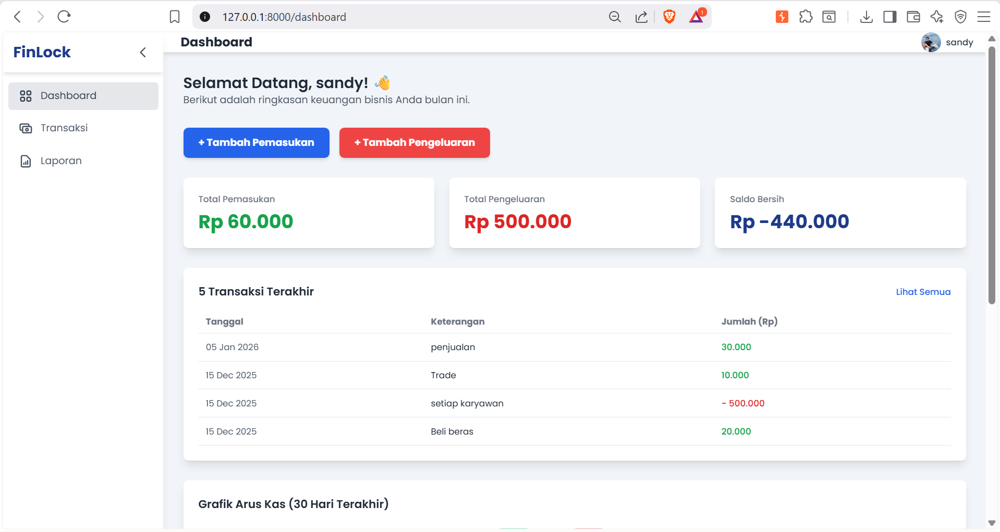

# FinLock - Aplikasi Pencatatan Keuangan UMKM 💰


## 📖 Deskripsi

**FinLock** adalah aplikasi manajemen keuangan berbasis web yang dikembangkan menggunakan **Framework Laravel**. Aplikasi ini dirancang khusus untuk membantu Usaha Mikro, Kecil, dan Menengah (UMKM) beralih dari pembukuan manual ke sistem digital.

Dengan FinLock, pemilik usaha dapat mencatat transaksi harian, memantau arus kas (cash flow), dan melihat ringkasan keuangan secara *real-time*, sehingga pengambilan keputusan bisnis menjadi lebih akurat dan efisien.

---

## ✨ Fitur Utama

* **Dashboard Interaktif**: Menampilkan ringkasan total pemasukan, pengeluaran, dan saldo terkini dalam tampilan visual yang mudah dipahami.
* **Pencatatan Transaksi (CRUD)**:
    * Input Pemasukan & Pengeluaran dengan detail (tanggal, kategori, nominal, deskripsi).
    * Edit dan Hapus data transaksi dengan mudah.
* **Manajemen Kategori**: Pengelompokan transaksi berdasarkan kategori kustom untuk analisis yang lebih baik.
* **Laporan Keuangan**: Tabel riwayat transaksi yang terstruktur dan mudah dibaca.
* **Autentikasi Pengguna**: Sistem login dan register yang aman untuk melindungi data keuangan.

---

## 🛠️ Teknologi yang Digunakan

* **Backend Framework:** Laravel 11
* **Bahasa Pemrograman:** PHP 8.4
* **Database:** MySQL
* **Frontend:** Blade Templating Engine, Tailwind CSS, JavaScript
* **Version Control:** Git

---

## ⚙️ Cara Instalasi & Menjalankan Project

Ikuti langkah-langkah berikut untuk menjalankan project ini di komputer lokal (Localhost):

1.  **Clone Repositori**
    ```bash
    git clone [https://github.com/SANDYKURNIIA/Finlock-Aplikasi-Pencatatan-Keuangan.git](https://github.com/SANDYKURNIIA/Finlock-Aplikasi-Pencatatan-Keuangan.git)
    cd Finlock-Aplikasi-Pencatatan-Keuangan
    ```

2.  **Install Dependencies**
    Pastikan kamu sudah menginstall [Composer](https://getcomposer.org/).
    ```bash
    composer install
    ```

3.  **Konfigurasi Environment**
    Salin file `.env.example` menjadi `.env`.
    ```bash
    cp .env.example .env
    ```

4.  **Generate App Key**
    ```bash
    php artisan key:generate
    ```

5.  **Konfigurasi Database**
    * Buat database baru di phpMyAdmin / MySQL Workbench (misal: `db_finlock`).
    * Buka file `.env` dan sesuaikan konfigurasi berikut:
    ```env
    DB_CONNECTION=mysql
    DB_HOST=127.0.0.1
    DB_PORT=3306
    DB_DATABASE=db_finlock
    DB_USERNAME=root
    DB_PASSWORD=
    ```

6.  **Migrasi Database**
    Jalankan migrasi untuk membuat tabel-tabel yang dibutuhkan.
    ```bash
    php artisan migrate
    ```

    *(Opsional) Jika ada seeder:*
    ```bash
    php artisan db:seed
    ```

7.  **Jalankan Server**
    ```bash
    php artisan serve
    ```

8.  **Akses Aplikasi**
    Buka browser dan kunjungi: `http://127.0.0.1:8000`

---

## 📸 Screenshots
| Dashboard | Halaman Transaksi |
| :---: | :---: |
|  |  |

---

## 👨‍💻 Author

**Sandy Kurnia Ramadhan**
* LinkedIn: [Sandy Kurnia Ramadhan](https://www.linkedin.com/in/sandy-kurnia-ramadhan-703995280/)
* GitHub: [@SANDYKURNIIA](https://github.com/SANDYKURNIIA)

---

> Project ini dibuat sebagai bagian dari portofolio pengembangan perangkat lunak dan implementasi teknologi Laravel untuk solusi bisnis UMKM.
